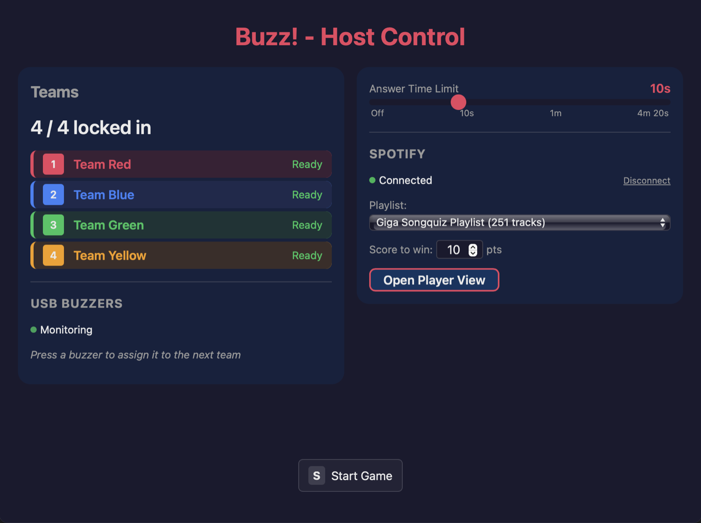
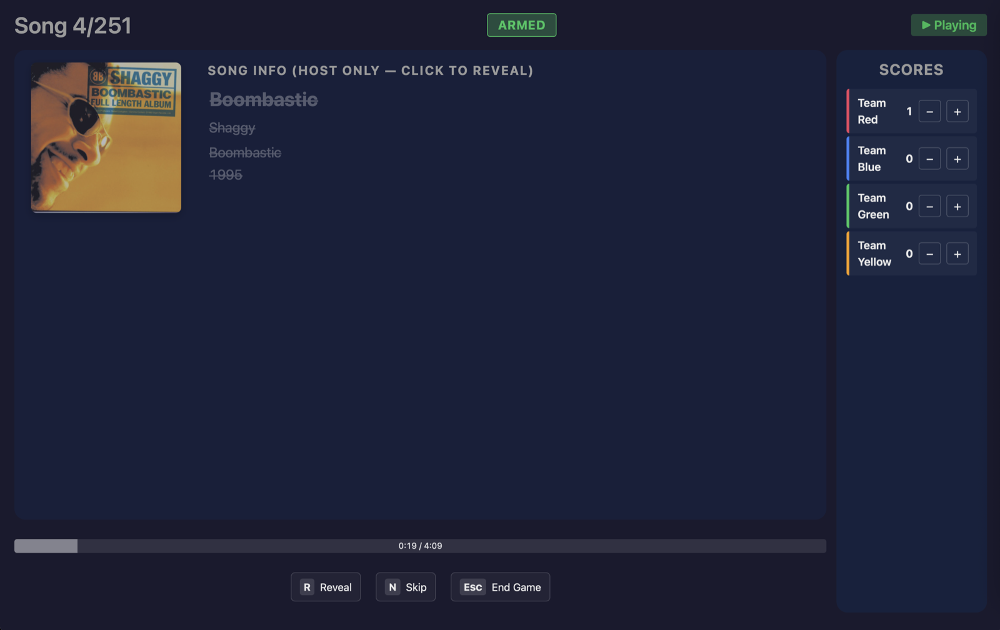
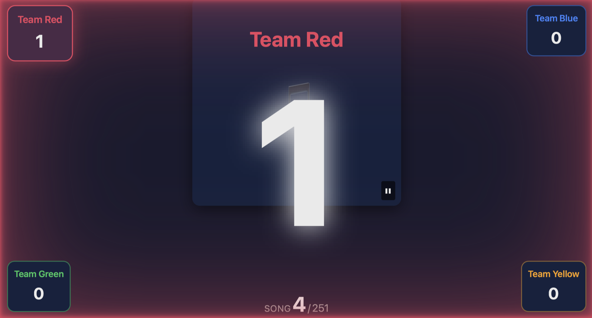
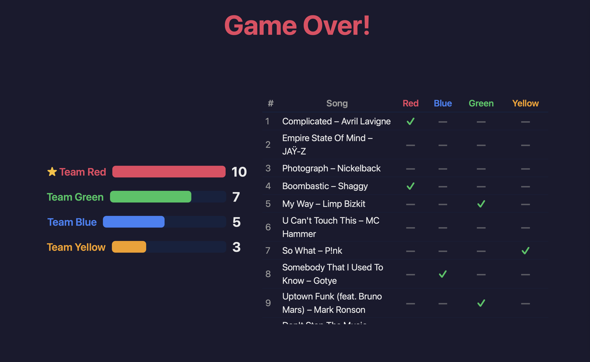

# Buzz 🎵

[](https://github.com/vossjona/buzz/actions/workflows/ci.yml)
[](LICENSE)
[](https://v2.tauri.app/)

A local desktop music-quiz buzzer game. Host a "guess the song" night from
your own Spotify playlists — teams race to buzz in with USB buzzers (or the
keyboard), the host judges, scores climb, confetti happens.

Built with Tauri v2 + React + TypeScript. Local-only: no server, no accounts,
no telemetry — only your Spotify connection.

|                                                  |                                              |
| :----------------------------------------------: | :------------------------------------------: |
|       |  |
|                   _Game setup_                   |            _Host view mid-round_             |
|  |   |
|                _A team buzzes in_                |              _Final scoreboard_              |

## Features

- **Guess-the-song gameplay** from any of your Spotify playlists
  (random order, no repeats)
- **2–4 teams** with USB HID buzzer support and keyboard fallback
- **Two windows**: a host control screen and a clean Player view for contestants
- **Granular reveals**: uncover title, artist, album, year, and cover art
  one piece at a time as hints
- **Answer timer** with 3-2-1 countdown overlay and sounds
- **Final scoreboard** with score chart and full song history
- **Local-only**: game logic runs entirely on your machine

## Requirements

- **Spotify Premium** + a free Spotify Developer app
  (5-minute setup — see [docs/SPOTIFY-SETUP.md](docs/SPOTIFY-SETUP.md))
- macOS, Windows, or Linux (developed on macOS; other platforms are
  supported by Tauri but less tested)

## Install

### Download (no dev tools needed)

Grab an installer from the [latest release](https://github.com/vossjona/buzz/releases/latest):
**macOS (Apple Silicon)** `Buzz_<version>_aarch64.dmg` · **Windows** `Buzz_<version>_x64-setup.exe`.
The builds are unsigned, so the OS warns on first launch —
**[docs/INSTALL.md](docs/INSTALL.md)** walks through it, plus the Spotify setup.

### Build from source

#### Prerequisites (macOS)

Before getting started, ensure you have the following installed:

1. **Xcode** (recommended for full Tauri support)
   - Install from the Mac App Store or [Apple Developer](https://developer.apple.com/xcode/)
   - Launch Xcode once to complete initial setup and accept the license:
     ```bash
     sudo xcodebuild -license accept
     ```
   - Note: For desktop-only development, Command Line Tools may suffice:
     ```bash
     xcode-select --install
     ```
   - See [Tauri v2 Prerequisites](https://v2.tauri.app/start/prerequisites/) for details

2. **Rust** (via rustup)

   ```bash
   curl --proto '=https' --tlsv1.2 https://sh.rustup.rs -sSf | sh
   ```

   After installation, restart your terminal or run:

   ```bash
   source "$HOME/.cargo/env"
   ```

3. **Node.js LTS** (v22+)

   ```bash
   # Using Homebrew
   brew install node

   # Or use a version manager like nvm or fnm
   ```

4. **pnpm** (v9+)

   ```bash
   # Using npm
   npm install -g pnpm

   # Or using Homebrew
   brew install pnpm
   ```

Windows/Linux users: see the [Tauri v2 prerequisites](https://v2.tauri.app/start/prerequisites/) for your platform.

#### Build and run

```bash
git clone https://github.com/vossjona/buzz.git
cd buzz
pnpm install
cp apps/desktop/.env.example apps/desktop/.env   # add your Spotify Client ID
pnpm dev
```

## Playing

See the **[Game Guide](docs/GAME-GUIDE.md)** for setup-screen settings, game
flow, and all host keys, and the **[Buzzer Guide](docs/BUZZERS.md)** for
pairing USB buzzers.

Quick reference: `1-4` lock in / buzz for a team · `S` start · `C`/`W` judge ·
`R` reveal · `N` next song · `Esc` end game.

## Documentation

| Doc                                    | What's inside                          |
| -------------------------------------- | -------------------------------------- |
| [Install guide](docs/INSTALL.md)       | Download, first launch, Spotify access |
| [Spotify setup](docs/SPOTIFY-SETUP.md) | Developer app, redirect URI, Client ID |
| [Game guide](docs/GAME-GUIDE.md)       | Settings, game flow, host keys         |
| [Buzzers](docs/BUZZERS.md)             | Supported hardware, pairing            |
| [Architecture](docs/ARCHITECTURE.md)   | How the code is organized              |
| [Contributing](CONTRIBUTING.md)        | Dev setup, conventions, PRs            |
| [Security](SECURITY.md)                | Token storage, reporting issues        |

## Project structure

```
buzz/
├── apps/desktop/      # Tauri v2 + React app (host + player UI, Spotify, HID buzzers)
│   └── src-tauri/     # Rust backend (buzzer HID monitoring, logging)
├── packages/engine/   # Pure TS game engine (teams, phases, scoring)
└── docs/              # Guides and architecture notes
```

## Scripts

| Script              | Description                                    |
| ------------------- | ---------------------------------------------- |
| `pnpm dev`          | Start Tauri desktop app in dev mode            |
| `pnpm build`        | Build production desktop app                   |
| `pnpm test`         | Run all package tests                          |
| `pnpm lint`         | Run ESLint across repo                         |
| `pnpm format`       | Format code with Prettier                      |
| `pnpm format:check` | Check formatting                               |
| `pnpm typecheck`    | Run TypeScript type checking                   |
| `pnpm check`        | Run all checks (format, lint, typecheck, test) |

## Session logs

Buzz writes one JSONL log file per app run — errors, unhandled rejections, and Spotify rate-limit events land in it. The file is created on app start and the folder keeps the last 10 sessions.

- **macOS:** `~/Library/Application Support/com.buzz.quizgame/logs/`
- **Windows:** `%APPDATA%\com.buzz.quizgame\logs\`
- **Linux:** `~/.local/share/com.buzz.quizgame/logs/`

Each file is named `session-<ISO-timestamp>.log` and contains one JSON object per line. To inspect the most recent session on macOS:

```bash
ls -t ~/Library/Application\ Support/com.buzz.quizgame/logs/ | head -n 1
```

There is no in-app log viewer — open the folder in your file browser or use `jq` / your editor of choice.

## Troubleshooting

### Common Issues

**Spotify problems** → see [docs/SPOTIFY-SETUP.md troubleshooting](docs/SPOTIFY-SETUP.md#troubleshooting)

**Xcode license not accepted**

```bash
sudo xcodebuild -license accept
```

**Rust not found**

```bash
source "$HOME/.cargo/env"
# Or restart your terminal
```

**Tauri CLI not found**
The Tauri CLI is installed as a dev dependency. Make sure to run commands via `pnpm`:

```bash
pnpm dev  # Uses local tauri CLI
```

**Port 8080 already in use**

```bash
# Find and kill the process using the port
lsof -ti:8080 | xargs kill -9
```

**Missing icons warning during build**
Icons are required for production builds. Generate icons with:

```bash
cd apps/desktop
pnpm tauri icon /path/to/your-icon.png
```

### Resources

- [Tauri v2 Documentation](https://v2.tauri.app/)
- [Tauri v2 Prerequisites](https://v2.tauri.app/start/prerequisites/)
- [Vite Documentation](https://vitejs.dev/)
- [React Documentation](https://react.dev/)

## License

[MIT](LICENSE)

The bundled sound effects (`apps/desktop/public/sounds/correct.mp3`,
`wrong.mp3`) are royalty-free audio clips.
